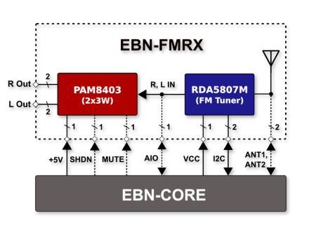
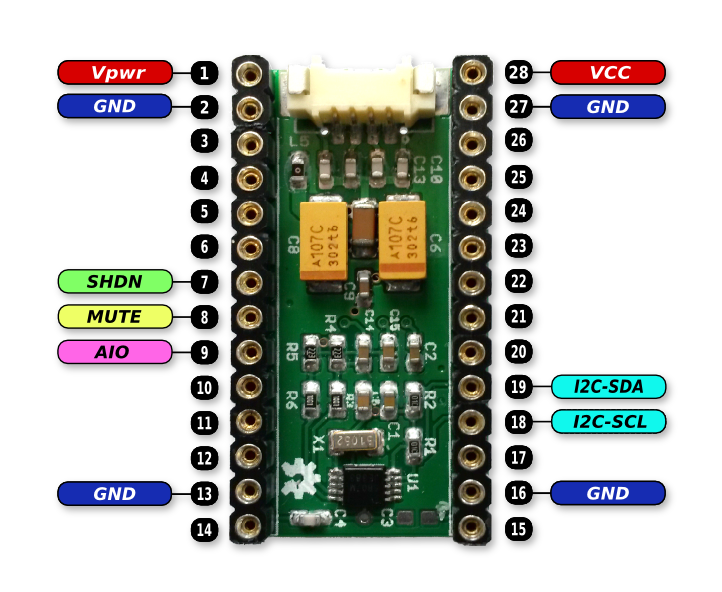

# EBN: FM Radio Shield

#### General Info

* **Base On:** RDA5807M (Single-Chip Broadcast FM Radio Tuner with RDS)
* **Output PA:** PAM8403/PAM8406 (FilterLess 3W/5W Class-D Stereo Audio Amplifier)
* **Control Pins:** Two GPIOs for Enable/Disable MUTE and SHUTDOWN
* **Main Interface:** I2C for tuning and controlling RDA5807M

#### Blocking Diagram of FM Radio Shield

  

#### PinOut of FM Radio Shield

  

#### Connection of GPS Shield with Core Shield

| EBN-FMPA        | EBN-KL27Z4  |
| --------------- | ----------- |
| I2C-SDA         | PTB1        |
| I2C-SCL         | PTB0        |
| SHDN            | PTA1        |
| MUTE            | PTA2        |
| AIO             | PTE30       |
