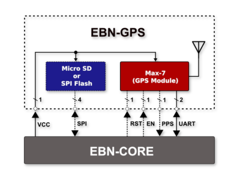
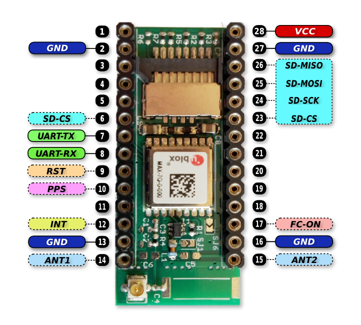

# EBN: GPS + SD Card Shield

#### General Info

* **Base On:** GPS module Ublox Max-7Q (also compatible with Quectel L70/L76 or SIMCom SIM26ML/SIM68M modules)
* **Optional Storage:** Micro SD Card or SPI Flash

### Block Diagram

  

### PinOut

  

#### Connection with Core Shield

| EBN-GPS         | EBN-KL27Z4  |
| --------------- | ----------- |
| SD-MISO         | PTC7        |
| SD-MOSI         | PTC6        |
| SD-SCKL         | PTC5        |
| SD-SCKL         | PTC5        |
| SD-CS (06 / 23) | PTD4 / PTC4 |
| UART-TX         | PTA1        |
| UART-RX         | PTA2        |
| RST             | PTE30       |
| PPS             | PTA18       |
| INT             | PTA4        |
| FC-ON           | PTE0        |

### Design files

 * [Schematic & PCB (Eagle 7.x)](eagle)