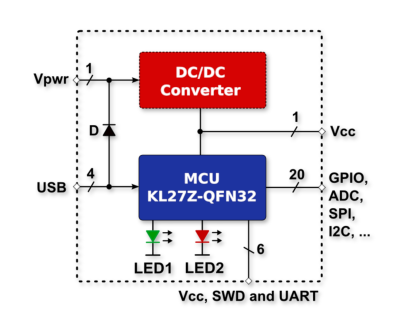
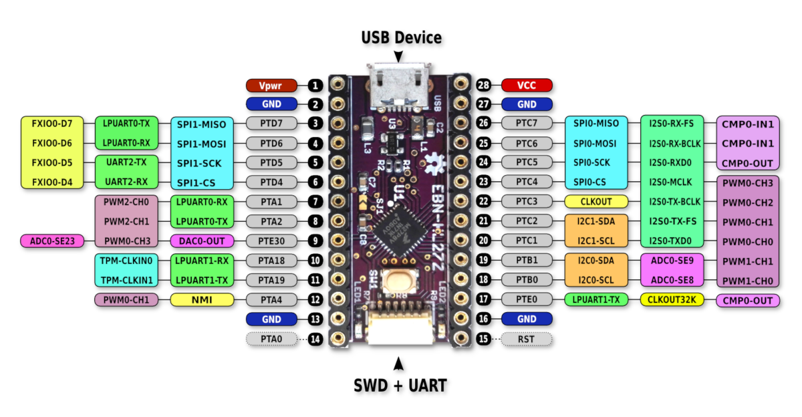

# EBN: KL27Z4 Core Shield

#### General Info

* **MCU:** Freescale MKL27Z256VFM4 in QFN32 package
* **ARM Core:** Cortex-M0+, 50MHz (max)
* **Memory's:** 256kB Flash and 32kB RAM
* **Serial Interfaces:** 1xUSB-Device, 3xUART, 2xSPI, 2xI2C, 1xI2S, ...
* **Other:** 16-bit ADC, 12-bit DAC, RTC, FlexIO (4xIO-Pins)

### Blocking Diagram

  

### PinOut

  

#### Internal Connections

| Name           | Pin    | Description                |
| -------------- | ------ | -------------------------- |
| LED1 (Green)   | VCC    | Power Status LED           |
| LED2 (Red)     | PTA3   | User or Error Status LED   |
| SW1 (Button)   | PTA4   | Enter into Bootloader      |

### Design files

 * [Schematic & PCB (Eagle 7.x)](eagle)

### OSH Park

<a href="https://oshpark.com/shared_projects/JpSgUC9z"></img></a>