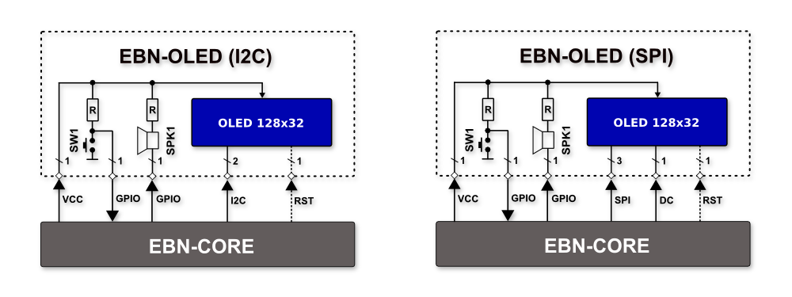
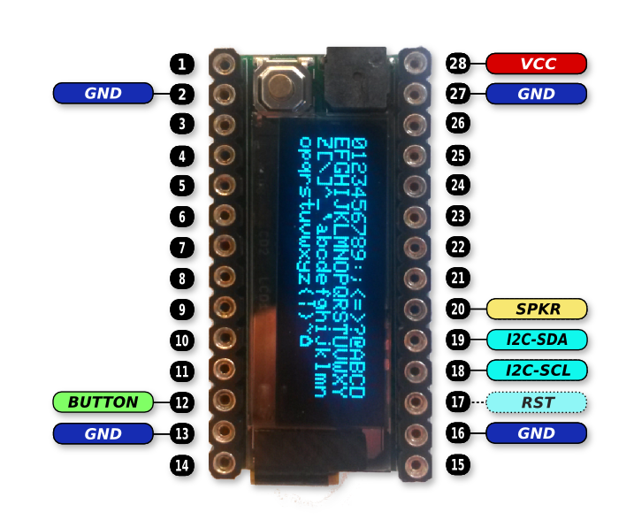
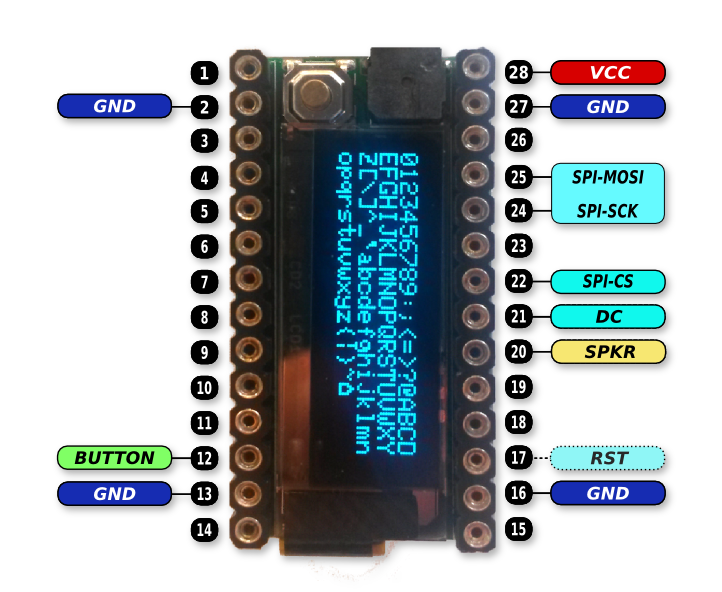

# EBN: OLED Shield

#### General Info

* **Base On:** 128x32 pixels OLED Display
* **Other:** Button and Speaker

### Blocking Diagram

  

### PinOut

  
  

#### Connection with Core Shield

| EBN-OLED-I2C    | EBN-KL27Z4  |
| --------------- | ----------- |
| BUTTON          | PTA4        |
| SPKR            | PTC1        |
| I2C-SDA         | PTB1        |
| I2C-SCL         | PTB0        |
| OLED-RST        | PTE0        |

| EBN-OLED-SPI    | EBN-KL27Z4  |
| --------------- | ----------- |
| BUTTON          | PTA4        |
| SPKR            | PTC1        |
| SPI-MISO        | PTC7        |
| SPI-MOSI        | PTC6        |
| SPI-SCKL        | PTC5        |
| OLED-DC         | PTC2        |
| OLED-RST        | PTE0        |

### Design files

 * [Schematic & PCB (Eagle 7.x)](eagle)