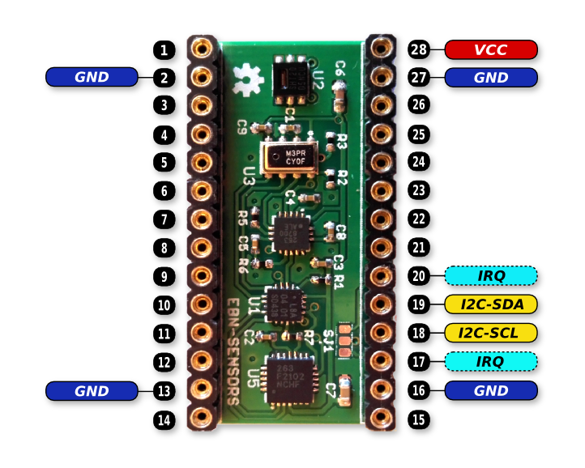

# EBN: Sensor Shield

#### General Info

* **Accelerometer:** FXOS8700
* **Magnetometer:** FXOS8700
* **Barometer:** MPL3115
* **Gyroscope:** FXAS21002
* **Humidity:** SHT2X

### Block Diagram

  

### PinOut

  

#### Connection with Core Shield

| EBN-S12D        | EBN-KL27Z4  |
| --------------- | ----------- |
| I2C-SDA         | PTB1        |
| I2C-SCL         | PTB0        |
| IRQ (20 / 17)   | PTC1 / PTE0 |

### Design files

 * [Schematic & PCB (Eagle 7.x)](eagle)