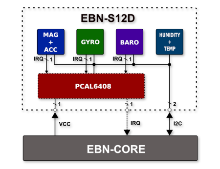

# EBN: Sensor Shield

#### General Info

* **Base On:** 128x32 pixels OLED Display
* **Other:** Button and Speaker

#### Block Diagram of Sensor Shield

  

#### PinOut of Sensor Shield

  

#### Connection of Sensor Shield with Core Shield

| EBN-S12D        | EBN-KL27Z4  |
| --------------- | ----------- |
| I2C-SDA         | PTB1        |
| I2C-SCL         | PTB0        |
| IRQ (20 / 17)   | PTC1 / PTE0 |
