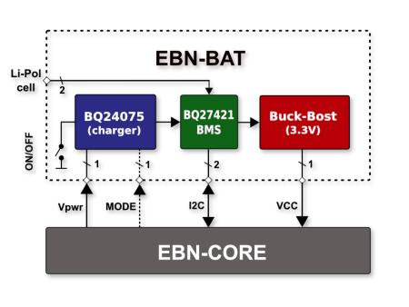
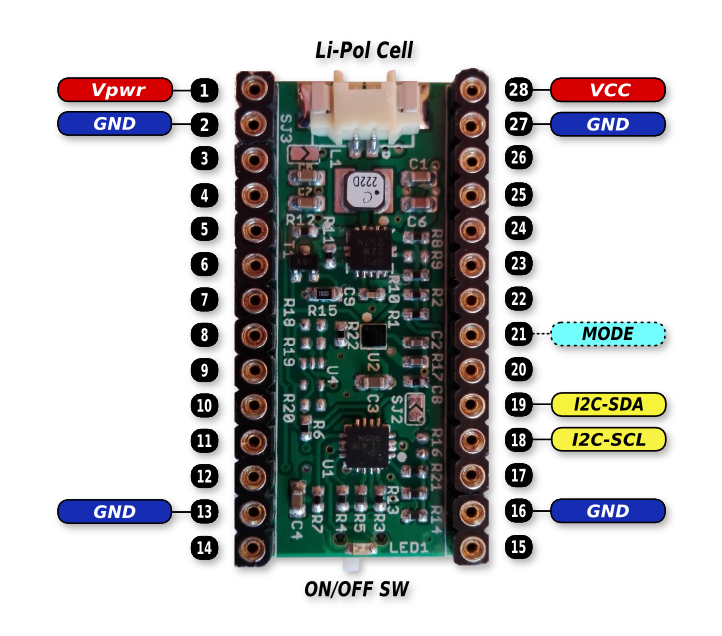

# EBN: Smart Battery Shield

#### General Info

* **Charger:** TI bq24075 (1A Li-Ion linear charger with power path)
* **BMS:** TI bq27421-G1 (System-Side Impedance Track Fuel Gauge With Integrated Sense Resistor)
* **DC/DC:** TI TPS6300x (High Efficient Single Inductor Buck-Boost Converter 3.3V/1A)

#### Blocking Diagram of Smart Battery Shield

  

#### PinOut of Smart Battery Shield

  

#### Connection of Smart Battery Shield with Core Shield

| EBN-SBAT        | EBN-KL27Z4  |
| --------------- | ----------- |
| I2C-SDA         | PTB1        |
| I2C-SCL         | PTB0        |
| MODE            | PTC2        |
