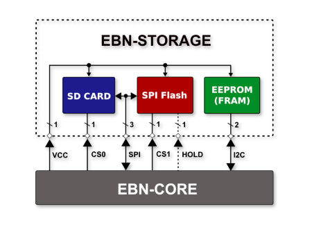
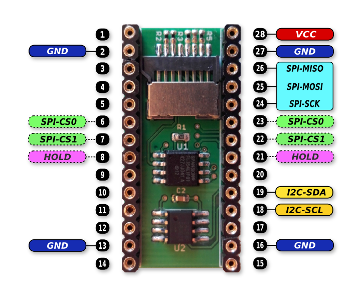

# EBN: Storage Shield

#### General Info

* **Base On:** Three different kinds of memories (SD Card, NAND Flash and EEPROM)
* **Micro SD Card:** Any type compatible with 3.3V power and SPI I/O interface
* **SPI Flash:**  ...
* **I2C EEPROM:**  ...

#### Block Diagram of Storage Shield

  

#### The PinOut of Storage Shield

  

#### Connection of Storage Shield with Core Shield

| EBN-STORAGE       | EBN-KL27Z4  |
| ----------------- | ----------- |
| SPI-MISO          | PTC7        |
| SPI-MOSI          | PTC6        |
| SPI-SCKL          | PTC5        |
| SPI-CS0 (06 / 23) | PTD4 / PTC4 |
| SPI-CS1 (07 / 22) | PTA1 / PTC3 |
| HOLD (08 / 21)    | PTA2 / PTC2 |
| I2C-SDA           | PTB1        |
| I2C-SCL           | PTB0        |
