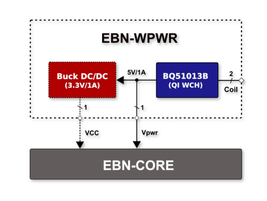
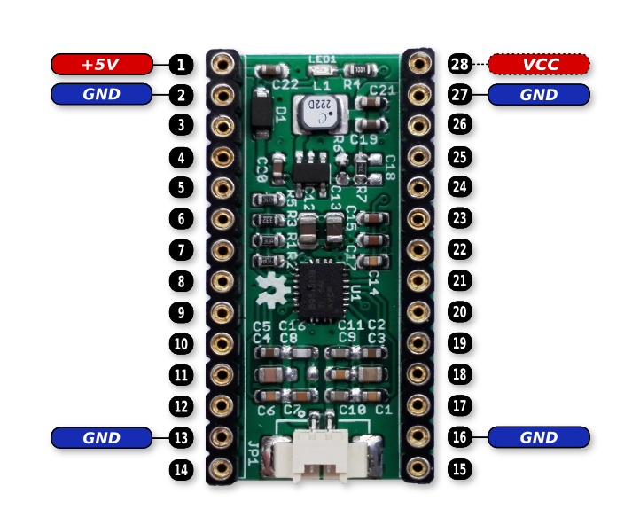

# EBN: Wireless Power Shield

#### General Info

* **Base On:** TI bq51013B (Highly Integrated Wireless Receiver Qi with 5V/1A Output)
* **DC/DC:** Optional DC/DC Buck Converter with 3.3V/1A Output

#### Block Diagram of Wireless Power Shield

  

#### The PinOut of Wireless Power Shield

  

